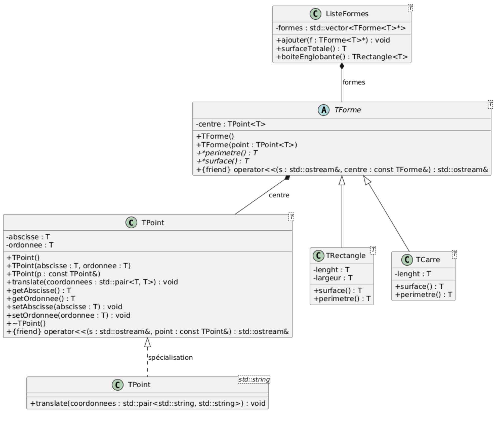

# Compte Rendu TP3 - Templates
**Jack et Annabelle**

## Objectif
Manipulation de classes templates avec héritage et surcharge d'opérateurs.

## Diagramme de classes

### Classe TPoint<T>
Classe template permet de faire un objet point 2D (abscisse, ordonnée) avec un template.

### Classe TForme<T>
Classe abstraite template contenant un centre (`TPoint<T>`). Définit deux méthodes virtuelles pures : `surface()` et `perimetre()`.

### Classes TRectangle<T> et TCarre<T>
Classes filles de `TForme<T>` qui implémentent `surface()` et `perimetre()` :
- **TRectangle** : longueur × largeur
- **TCarre** : côté²

### Spécialisation
Spécialisation de `TPoint<std::string>` : la méthode `translate()` est redéfinie pour utiliser `std::swap` au lieu de l'addition, permettant d'échanger les coordonnées plutôt que de les additionner.

### Liste de formes 
Classe template contenant un vecteur de pointeurs vers `TForme<T>`. Méthodes :
- `ajouter()` : ajoute une forme à la liste
- `surfaceTotale()` : calcule la somme des surfaces
- `boiteEnglobante()` : retourne un rectangle englobant toutes les formes 